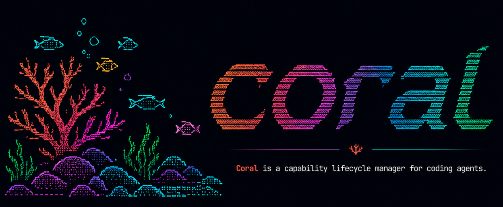

<p align="center">
  
</p>

# Coral

[](LICENSE)
[](https://github.com/kannandreams/coral)

Coral is a CLI for managing project-owned agent capabilities: skills, tools,
hooks, and workflows that teams load into coding harnesses such as Codex,
Claude, Cursor, and others.

Coral keeps capability files in the project while tracking the metadata around
them: source, version, target harness, scope, and a pristine install baseline.
That makes local customization visible instead of turning it into an
untracked copy.

The core is content-agnostic. Capability content can live in the repository
that owns it or in a separate pack repository. Coral handles manifests,
installation, validation, drift detection, diffs, updates, and target-specific
emission. The current adapters include the shared `.agents/` layout and
Claude-oriented output.

## How the lifecycle works

1. Create or import a capability.
2. Install it for one or more harness targets.
3. Coral records the emitted files and an install-time baseline under `.coral/`.
4. Edit the project-owned files normally; `coral list`, `coral status`, and
   `coral diff` report drift.
5. Re-import intentional local changes or update git-sourced capabilities when
   upstream changes are available.

Project and global scopes are supported. Project capabilities take precedence
when the same id exists in both scopes, and Coral reports that relationship in
status output.

## Documentation

The documentation site is built with Starlight on Astro in `website/`:

```sh
cd website
npm install
npm run dev
```

Build the static docs site:

```sh
cd website
npm run build
```

Start with:

- [Introduction](website/src/content/docs/index.md)
- [Usage Scenarios](website/src/content/docs/usage-scenarios.md)
- [Skills.sh and Vercel Skills Comparison](website/src/content/docs/comparison/vercel-skills.md)

## Install for local development

From this repository:

```sh
cargo run -- --help
cargo run -- --version
```

To install the CLI from this checkout while developing locally:

```sh
cargo install --path .
coral --version
```

The repository requires a recent Rust toolchain with Cargo. There is currently
no dependency on a separately installed JavaScript runtime for the CLI itself.

## Test from another directory

This is the closest local workflow to how an engineer would try Coral after
installing it:

```sh
cargo install --path .
mkdir -p /tmp/coral-smoke
cd /tmp/coral-smoke
coral --version
coral init
coral target add open-agents
coral add /absolute/path/to/coral/examples/fixtures/python-uv-default -t open-agents
coral list
```

From this repo, the same smoke test is wrapped as:

```sh
just smoke-install
```

## CLI usage

```sh
coral
coral --version
coral init
coral target add open-agents
coral add examples/fixtures/python-uv-default -t open-agents
coral list
coral diff python-uv-default
```

Running `coral` with no arguments shows the terminal banner and starter menu.

`coral init` creates `.coral/coral-lock.json`, scaffolds the standard `.agents/`
directories, and installs the small `coral-cli-guide` reference skill. It does
not install third-party capabilities or create a user skill for you.

The CLI is built from the Rust crate in this repository, and `Cargo.lock` is
committed for reproducible builds.

The `examples/fixtures/python-uv-default` primitive is a demo/test fixture, not
a bundled standard pack. Production capabilities should live in separate pack
repositories or in the repositories that use them.

## Developer commands

`just` is only a contributor convenience wrapper for this repo, not the user
interface:

```sh
just setup
just check
just run -- --help
```

End users should run `coral ...` directly.

## Packaging direction

For now, the supported development install is from a checkout:

```sh
cargo install --path .
```

Standalone release binaries and a Homebrew tap are planned after the CLI
contract, lockfile format, and capability lifecycle have stabilized. Until
then, the repository checkout and Cargo install path are the source of truth
for running Coral locally.

## License

Coral is released under the MIT License. See [LICENSE](LICENSE).
